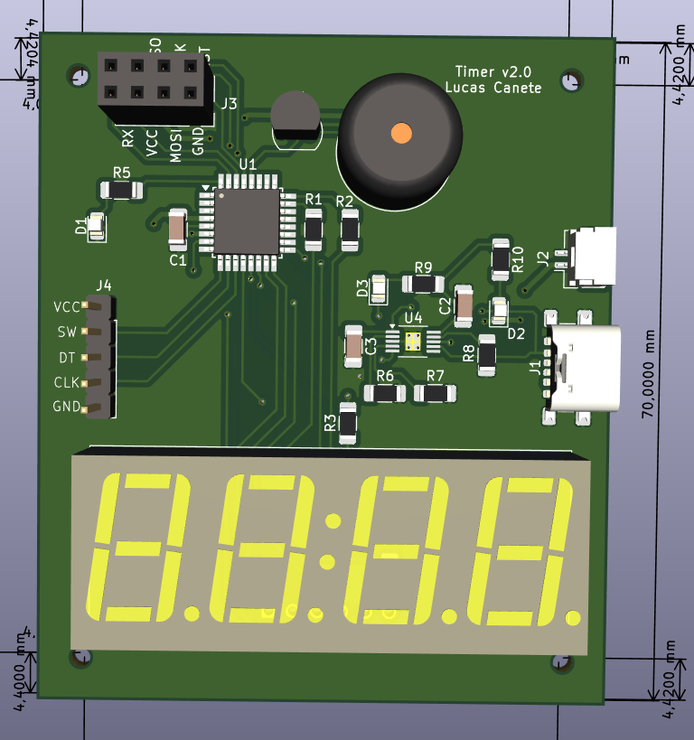
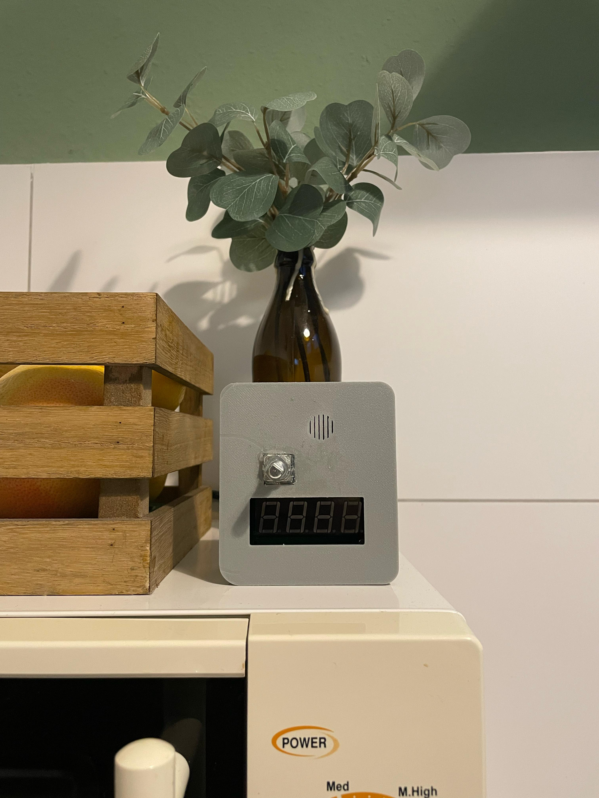

# KitchenAlarm
A small Atmega168 based Kitchentimer to measure cooking time for your meals. Forget about downloading another app or using your phone. Do it the old fashioned way, like  it's the 90's. Put the pizza in the oven, configure your Kitchenalarm and let it beep like a fire alarm on steroids when your pizza is ready.

## Table of Contents
1. [About the Project](#about-the-project)
2. [Features](#features)
3. [Components](#components)
4. [Getting Started](#getting-started)
5. [Project Status](#project-status)

## About the project
This one was one of my first projects writing bare metal C. What i wanted to do is develop the simplest device possible, write the software, make a pcb and print a 3D case for it. A Timer is a device everyone is familiar with, so i decided to go for that. I took an atmega168, programmed it using avrdude and made a simple pcb for the circuitry using KiCad. Using the OnShape software i designed a case for the pcb and this was the end result.

## Features
- Rotary Encoder for configuring minutes and seconds
- 4 Digit 7 Segment Display for displaying the time
- Buzzer Alarm for beeping when time has runned up
- Deep sleep Mode after 1 Minute of not receiving instructions

## Components
| Component | Model  | Manufacturer  |
|:--------|:------:|------:|
| Microcontroller  | atmega168 | Microchip |
| 7 Seg. Display  | Generic | - |
| Rotary Encoder Module  | KY-040 | - |
| Battery Charger  | BQ24090 | Texas Instruments |

## Getting Started
### Install AVRDUDE
```
sudo apt install avrdude
```
### Download this repo
```
git clone https://github.com/LucasCanete/KitchenAlarm.git
```
### Build and upload 
Connect the KitchenAlarm to the PC using usbasp and upload the code:
```
cd KitchenAlarm/Software
$KitchenAlarm/Software make
$KitchenAlarm/Software make flash
```
### Use
The Kitchenalarm has a **Rotary Encoder** that lets you configure the Minutes and Seconds through the encoder's rotation.
1. Press the Rotary Encoder on the board to configure the Minutes and adjust it rotating the encoder 
2. Press it once again to configure the Seconds and rotate it to adjust 
3. Press the encoder one last time to activate the Timer with the Minutes and Seconds you configured in step 1 and step 2. The Timer will start counting down on the 7-Segment Display (To reset the countdown press the Encoder)
4. When the Timer reaches 00:00 (on the Display) the buzzer on the Board will start beeping. Your pizza is ready. Press the Encoder once to stop the beeping
5. The Kitchenalarm goes automatically to deep sleep if it is not given instructions. To wake it up just press the Encoder


<p align="center">
    
   
</p>

## Project Status
The project is still under development after version 1. Some new improvements that are being implemented for version 2 are:
- [x] Grounded plane in both PCB layers to reduce noise
- [x] SMD Components
- [x] USB-C Port for battery charging 
- [x] Programming port to match usbasp
      
These new features have already been implemented in the new KiCad design and can be seen in the **Hardware** directory. Once i solder the new pcb i will upload the results with pictures.
